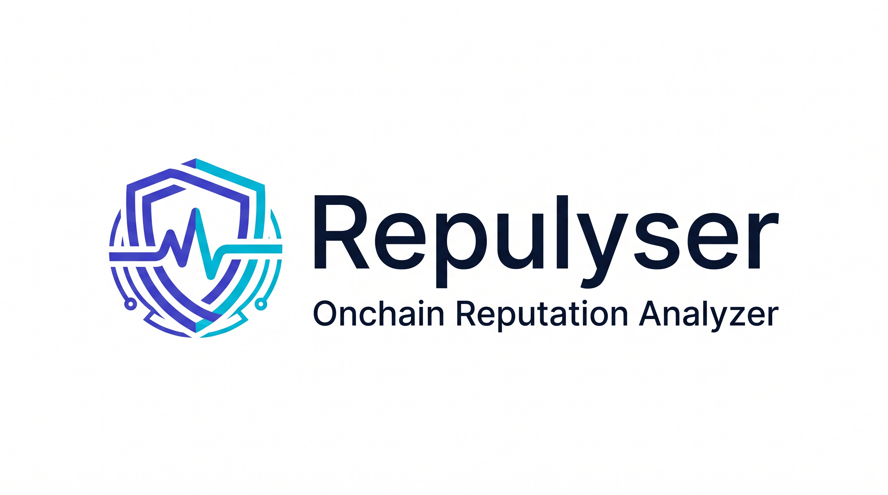

# Repulyser



**An onchain reputation analyzer for EVM chains, built with Foundry.**

Repulyser ships three Solidity contracts — `ReputationRegistry`, `ReputationAnalyzer`, and `ReputationAttestor` — that together let any AI agent answer the question *"what is the reputation of `0x...`?"* with a single `cast call`. The analyzer returns a composite `0..10000` score, a tier (Unverified → Bronze → Silver → Gold → Platinum → Diamond), and a per-signal-type breakdown across 10 dimensions: account age, tx volume, tx frequency, DeFi interactions, governance votes, NFT holdings, social endorsements, contract deploys, asset diversity, and liquid staking. Scores are attestor-weighted and decay linearly over a configurable staleness window (default 90 days).

Built strictly with Foundry (`forge` / `cast`). No Python, no JavaScript, no off-chain indexer.

---

## Why this exists

Most onchain tooling answers *what did this address do?* Repulyser answers *should I trust this address?*

The system has three pieces:

- **ReputationRegistry** — append-only signal storage. Approved attestors (bots, DAOs, multisigs) write normalized 0..10000 signals about any address.
- **ReputationAnalyzer** — pure view-only scoring. Consumes signals, applies attestor-weighted averaging and time decay, returns a composite score, tier, and breakdown.
- **ReputationAttestor** — a small helper contract that lets an attestor bot queue dozens of signals in memory and flush them in a single `forge script` transaction.

The result: an agent can say *"Wallet `0xAbc…` is Silver-tier with strong DeFi interactions but no governance history"* from one tuple.

---

## Framework

Repulyser is built and consumed entirely through **Foundry** — the `forge` and `cast` CLI tools. There is no npm, no Python, no JavaScript runtime, and no off-chain indexer.

| Tool | Role |
|---|---|
| `forge` | Compile, test, deploy, run scripts. The only build tool. |
| `cast` | Read state via `cast call`, write state via `cast send`. The only on-chain I/O. |
| `forge-std` | Test + script standard library (vendored as a git submodule under `lib/forge-std`). |

The contracts use `solc 0.8.24` with the optimizer on and the IR pipeline enabled (see `foundry.toml`). They are pure Solidity — no external protocol dependencies at runtime, so Repulyser is portable to any EVM-compatible chain.

As an AI-agent skill, Repulyser is loaded by the agent's skill engine and exposes its capabilities through the `SKILL.md` frontmatter. Compatible with any agent framework that can shell out to `cast` / `forge` (OpenClaw, Claude Code, Codex, etc.).

---

## Network

Repulyser is **chain-agnostic**. The three contracts have no hard-coded chain assumptions — they compile and deploy to any EVM chain that supports `solc 0.8.24` output and the standard `blockscout` block-explorer API for verification.

`assets/networks.json` is the canonical network config. It ships with two generic placeholder entries (`example-testnet` and `example-mainnet`) that you replace with your chain's RPC, chain ID, and explorer URL. The shape is:

```json
{
  "name": "<your-network>",
  "rpcUrl": "https://...",
  "chainId": 12345,
  "explorerUrl": "https://...",
  "explorerApiUrl": "https://...",
  "nativeToken": "ETH"
}
```

| Field | Used for |
|---|---|
| `rpcUrl` | `--rpc-url` on every `forge` / `cast` command |
| `chainId` | `forge verify-contract --chain-id` |
| `explorerApiUrl` | `forge verify-contract --verifier-url` |
| `explorerUrl` | Building user-facing "view on explorer" links |
| `nativeToken` | Displaying balances in human-readable output |

Pick the network with `jq`:

```bash
RPC_URL=$(jq -r '.networks[] | select(.name=="<your-network>") | .rpcUrl' assets/networks.json)
```

Or pass `--rpc-url $YOUR_RPC_URL` directly and skip the file entirely.

---

## Dependencies

### Runtime

- **Foundry** (`forge`, `cast`, `anvil`, `chisel`) ≥ `v1.0.0`. Recommended: latest stable.
- **EVM RPC endpoint** for the chain you want to deploy to. HTTP or WebSocket.
- **Ether / native token** for gas. The combined deploy of all three contracts is well under 4M gas.

### Build / dev

- **Git** with submodule support (for pulling `lib/forge-std`).
- **A C/C++ toolchain** (only for the optional `foundryup` installer on first install).

### Submodules

This repo uses one git submodule:

| Path | URL | Why |
|---|---|---|
| `lib/forge-std` | https://github.com/foundry-rs/forge-std | Solidity stdlib for tests + scripts (`Test.sol`, `Script.sol`, `console.sol`, ...). Pinned via `.gitmodules`. |

Clone with submodules in one go:

```bash
git clone --recurse-submodules https://github.com/visitseyi1/Repulyser.git
```

Or if you already cloned without them:

```bash
git submodule update --init --recursive
```

### Contract dependencies

**None.** The contracts import only `forge-std` (test/script side) and have no on-chain dependencies on OpenZeppelin, Chainlink, or any other library. They are fully self-contained Solidity.

### Verifying versions

```bash
forge --version     # forge Version: 1.x.y
solc --version      # used by forge internally; pinned to 0.8.24 via foundry.toml
cast --version
anvil --version
```

---

## How to test

Three levels, fastest first. Pick the one that matches what you want to verify.

### Level 1 — unit tests (10 seconds, no chain needed)

```bash
forge test
```

Expected: `Suite result: ok. 29 passed; 0 failed; 0 skipped`. Covers registry, analyzer, helper, time decay, tier thresholds, fuzz bounds. No RPC, no deploy.

For verbose output of any test:

```bash
forge test -vvv --match-test test_WeightedAttestorsAverage
```

For gas profiling:

```bash
forge test --gas-report
```

### Level 2 — end-to-end on a local `anvil` node (30 seconds, no real chain)

This is the recommended way to confirm "is this thing actually working?". Spins up an in-process EVM node, deploys all three contracts, pushes 10 demo signals, queries the analyzer, and prints the report.

```bash
./scripts/smoke-test.sh
```

Expected last lines:

```
==> 5/6 query reputation via cast call
    score:    ~4800 / 10000  (48.xx %)
    tier:     Silver
    coverage: 10 / 10 signal types

==> smoke test PASSED
```

The script leaves `anvil` running on `http://127.0.0.1:8545` after completion (it auto-cleans on exit) so you can run extra queries against the live local contracts — the script prints the exported env vars at the end.

You can also run the steps manually if you want full control:

```bash
# 1. Start a local node
anvil --port 8545 &

# 2. Deploy with demo data
PRIV=0xac0974bec39a17e36ba4a6b4d238ff944bacb478cbed5efcae784d7bf4f2ff80
DEMO=1 forge script script/DeployRepulyser.s.sol:DeployRepulyser \
  --rpc-url http://127.0.0.1:8545 --private-key $PRIV --broadcast

# 3. Read the deployed addresses
jq '.transactions[] | select(.contractName=="ReputationAnalyzer") | .contractAddress' \
  broadcast/DeployRepulyser.s.sol/31337/run-latest.json

# 4. Query the analyzer
ANALYZER=0xe7f1725E7734CE288F8367e1Bb143E90bb3F0512
cast call $ANALYZER "quickScore(address)(uint16,uint8,uint8)" \
  0xf39Fd6e51aad88F6F4ce6aB8827279cffFb92266 --rpc-url http://127.0.0.1:8545
# -> 4894
# -> 2        (Silver)
# -> 10       (coverage: 10/10)
```

### Level 3 — deploy to a real testnet (5-10 minutes)

```bash
# 1. Set your testnet RPC and a funded private key
export RPC_URL="https://your-rpc.example"
export PRIVATE_KEY=0xyour...

# 2. Deploy (set DEMO=1 to also push 10 demo signals)
DEMO=1 forge script script/DeployRepulyser.s.sol:DeployRepulyser \
  --rpc-url $RPC_URL --private-key $PRIVATE_KEY --broadcast

# 3. Save the three addresses to assets/deployments.json

# 4. Query any address on the live chain
ANALYZER=0x...   # from step 2 output
cast call $ANALYZER "quickScore(address)(uint16,uint8,uint8)" \
  0xSomeAddress --rpc-url $RPC_URL
```

### Quick checks (one-liners)

| Check | Command |
|---|---|
| Contracts compile | `forge build` |
| Formatting is clean | `forge fmt --check` |
| All 29 tests pass | `forge test` |
| Run a single test | `forge test --match-test test_AllMaxSignalsGiveDiamond -vvv` |
| Fuzz bounds hold | `forge test --match-test testFuzz` |
| Gas report | `forge test --gas-report` |
| Full local e2e | `./scripts/smoke-test.sh` |
| Deploy to testnet | `forge script script/DeployRepulyser.s.sol:DeployRepulyser --rpc-url $RPC_URL --private-key $PRIVATE_KEY --broadcast` |
| Pretty-print report | `SUBJECT=0x.. ANALYZER=0x.. forge script script/AnalyzeReputation.s.sol:AnalyzeReputation` |
| One-shot shell query | `SUBJECT=0x.. RPC_URL=... bash assets/templates/template_analyze.sh.tpl` |

---

## Usage

A complete walkthrough from a clean machine to a live reputation report.

### 1. Install Foundry

```bash
curl -L https://foundry.paradigm.xyz | bash
foundryup
cast --version
```

### 2. Clone, build, test

```bash
git clone --recurse-submodules https://github.com/visitseyi1/Repulyser.git
cd Repulyser
forge build
forge test            # 29 tests, all green
forge fmt --check     # formatting check
```

### 3. Configure your network

Edit `assets/networks.json` and replace the placeholder entries with your chain. Or set the env var directly:

```bash
export RPC_URL="https://your-rpc.example"
export PRIVATE_KEY=0xyour...
```

### 4. Deploy

```bash
# Plain deploy
forge script script/DeployRepulyser.s.sol:DeployRepulyser \
  --rpc-url $RPC_URL \
  --private-key $PRIVATE_KEY \
  --broadcast

# Bootstrap with demo data (registers deployer as first attestor + 10 signals)
DEMO=1 forge script script/DeployRepulyser.s.sol:DeployRepulyser \
  --rpc-url $RPC_URL \
  --private-key $PRIVATE_KEY \
  --broadcast
```

The script prints the three deployed addresses. Save them to `assets/deployments.json` (template at `assets/deployments.example.json`).

```bash
REGISTRY=0xRRRR...
ANALYZER=0xAAAA...
HELPER=0xHHHH...
```

### 5. Query a wallet

Read-only — no private key needed:

```bash
SUBJECT=0xYourTarget

# Quick: score + tier + coverage
cast call $ANALYZER "quickScore(address)(uint16,uint8,uint8)" \
  $SUBJECT --rpc-url $RPC_URL

# Tier number → string ("Unverified", "Bronze", ..., "Diamond")
cast call $ANALYZER "tierString(uint8)(string)" 2 --rpc-url $RPC_URL

# Full per-signal-type breakdown
SUBJECT=$SUBJECT ANALYZER=$ANALYZER \
  forge script script/AnalyzeReputation.s.sol:AnalyzeReputation
```

Or use the bundled shell template:

```bash
SUBJECT=0xYourTarget RPC_URL=$RPC_URL bash assets/templates/template_analyze.sh.tpl
```

### 6. Push signals (attestor path)

The registry owner registers an attestor once; the attestor can then push signals forever after.

```bash
# One-time: owner registers the bot
cast send $REGISTRY "registerAttestor(address,string)" $BOT "Repulyser Bot" \
  --rpc-url $RPC_URL --private-key $PRIVATE_KEY

# Per signal: attestor writes a single (subject, type, score, weight, data) record
cast send $REGISTRY "submitSignal(address,uint8,uint16,uint16,bytes)" \
  0xSubject 0 6500 8000 0x \
  --rpc-url $RPC_URL --private-key $PRIVATE_KEY
```

For batch writes (dozens of signals in one transaction), use the helper — see `references/helper.md`:

```bash
# Register the helper itself as the attestor (one-time)
cast send $REGISTRY "registerAttestor(address,string)" $HELPER "Repulyser Attestor Helper" \
  --rpc-url $RPC_URL --private-key $PRIVATE_KEY

# Queue N signals (one tx per queue call, or use a forge script for batching)
cast send $HELPER "queue(address,uint8,uint16,uint16,bytes)" 0xSubject 0 6500 8000 0x \
  --rpc-url $RPC_URL --private-key $PRIVATE_KEY

# Flush all queued signals in one transaction
cast send $HELPER "submitAll()" \
  --rpc-url $RPC_URL --private-key $PRIVATE_KEY
```

### 7. Verify on the block explorer (optional)

```bash
CHAIN_ID=$(jq -r '.networks[] | select(.name=="<your-network>") | .chainId' assets/networks.json)
EXPLORER_API_URL=$(jq -r '.networks[] | select(.name=="<your-network>") | .explorerApiUrl' assets/networks.json)

forge verify-contract $REGISTRY src/ReputationRegistry.sol:ReputationRegistry \
  --chain-id $CHAIN_ID --verifier-url $EXPLORER_API_URL --verifier blockscout

forge verify-contract $ANALYZER src/ReputationAnalyzer.sol:ReputationAnalyzer \
  --chain-id $CHAIN_ID --verifier-url $EXPLORER_API_URL --verifier blockscout \
  --constructor-args $(cast abi-encode "constructor(address)" $REGISTRY)

forge verify-contract $HELPER src/ReputationAttestor.sol:ReputationAttestor \
  --chain-id $CHAIN_ID --verifier-url $EXPLORER_API_URL --verifier blockscout \
  --constructor-args $(cast abi-encode "constructor(address)" $REGISTRY)
```

> If verifying immediately after deployment, wait ~10 seconds for the explorer indexer to catch up.

### 8. As an AI-agent skill

The agent loads `SKILL.md` and follows the bundled capability index. Read-only questions ("analyze 0x…") need no key and no extra setup beyond the deployed `ANALYZER` address. Write requests require the standard pre-checks (key set → derive address → confirm network).

---

## Layout

```
.
├── SKILL.md                 # AI-agent skill manifest
├── foundry.toml             # Foundry config (solc 0.8.24, via-ir, optimizer)
├── remappings.txt
├── src/
│   ├── IReputationRegistry.sol   # Interface
│   ├── ReputationRegistry.sol    # Signal storage + attestor management
│   ├── ReputationAnalyzer.sol    # View-only composite scoring + tier
│   └── ReputationAttestor.sol    # Batch helper for attestors
├── script/
│   ├── DeployRepulyser.s.sol     # One-shot deploy (3 contracts)
│   └── AnalyzeReputation.s.sol   # Pretty-print a reputation report
├── test/
│   └── Repulyser.t.sol           # 29 tests covering registry, helper, analyzer
├── references/                   # Skill reference docs the agent reads
│   ├── deploy.md
│   ├── analyze.md
│   ├── registry.md
│   ├── helper.md
│   └── scoring.md
└── assets/
    ├── networks.json             # Example RPC + chain IDs
    ├── deployments.example.json  # Template for tracking deployed addresses
    ├── scoring.example.json      # Type weights + tier thresholds
    ├── signal-types.json         # Enum + per-signal-type scoring hints
    └── templates/
        └── template_analyze.sh.tpl
```

---

## Scoring model (TL;DR)

- **10 signal types** with fixed weights (in basis points, sum = 10000):
  - AccountAge, TxVolume, TxFrequency, DefiInteractions, GovernanceVotes (1500 / 1200 / 1000 / 1500 / 1500)
  - NftHoldings, SocialEndorsements, ContractDeploys, AssetDiversity, LiquidStaking (600 / 400 / 800 / 800 / 700)
- For each type, the analyzer takes the **attestor-weighted average** of the latest fresh signals.
- Applies **linear time decay** over the staleness window (default 90 days): full credit at `age=0`, zero at `age≥window`.
- **Final score** = Σ(decayed × typeWeight) / 10000, in `[0, 10000]`.
- **Tier** thresholds: Bronze 20, Silver 40, Gold 60, Platinum 80, Diamond 95 (in percent).

See `references/scoring.md` for the full breakdown and a worked example.

---

## Tests

```
$ forge test
Ran 29 tests for test/Repulyser.t.sol:RepulyserTest
[PASS] testFuzz_ScoreInBounds(uint16,uint16) (runs: 256, μ: 200332, ~: 200244)
[PASS] test_AllMaxSignalsGiveDiamond()
[PASS] test_AttestorRegistration()
[PASS] test_AttestorSubmitsSignal()
[PASS] test_EmptySubjectIsUnverified()
[PASS] test_HelperQueueAndSubmit()
[PASS] test_HelperRejectsZeroRegistry()
[PASS] test_HelperSubmitAll()
[PASS] test_LatestSignalOfMissing()
[PASS] test_LatestSignalOfUpdates()
[PASS] test_OnlyOwnerCanRegisterAttestor()
[PASS] test_OwnerIsDeployer()
[PASS] test_PerSubjectIsolation()
[PASS] test_QuickScore()
[PASS] test_ReentrancyGuardOnRevoke()
[PASS] test_RevokeAttestor()
[PASS] test_ScoreBoundsEnforced()
[PASS] test_SetStalenessWindow()
[PASS] test_SetTypeWeight()
[PASS] test_SingleSignalWeightsApply()
[PASS] test_StrangerCannotSubmitSignal()
[PASS] test_SubjectDoubleRegisterReverts()
[PASS] test_SubjectSelfRegistration()
[PASS] test_TierStrings()
[PASS] test_TierThresholds()
[PASS] test_TimeDecayForStaleSignals()
[PASS] test_TimeDecayPartial()
[PASS] test_TypeWeightsSumTo10000()
[PASS] test_WeightedAttestorsAverage()
Suite result: ok. 29 passed; 0 failed; 0 skipped
```

Covers:
- **Registry**: owner gating, attestor management, subject self-registration, signal bounds, revoke flow, latest-pointer semantics, edge cases on missing/deleted signals.
- **Analyzer**: empty subjects, single signal, full-max (Diamond), attestor-weighted averaging, time decay (full and partial), tier thresholds, per-subject isolation, type-weight sum invariant, configuration setters.
- **Attestor helper**: queue, single submit, batch submitAll, double-submit reverts, non-attestor rejection.
- **Fuzz**: random score/weight inputs stay in `[0, 10000]`.

---

## License

MIT. See [`LICENSE`](./LICENSE).

---

## Logo

The Repulyser mark is a hexagonal shield (representing trust) with a pulse waveform running through it (representing onchain reputation signals). The two small leads leaving the shield at the bottom represent the **input** signals (from attestors) and the **output** (the analyzed reputation score). Color palette is **indigo `#4F46E5`** to **cyan `#06B6D4`** on light, lighter shades (`#818CF8` / `#22D3EE`) on dark backgrounds.

Files in `assets/`:

| File | Use |
|---|---|
| `assets/logo-horizontal.png` | README hero, docs, social cards (2752×1536) |
| `assets/logo.png` | Standalone square icon, light theme (1024×1024) |
| `assets/logo-dark.png` | Standalone square icon, dark theme (1024×1024) |
| `assets/logo.svg` | Source vector for the light icon (scalable, editable) |
| `assets/logo-dark.svg` | Source vector for the dark icon |
| `assets/favicon.png` | 256×256 favicon for docs sites / web UI |

If you want to use the mark in your own project, please keep the colors and proportions intact. The SVG sources are the canonical versions — the PNGs are rasterizations.
